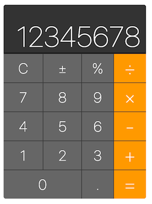

# purescript-calculator-example

This example uses purescript-react-basic to implement a simple calculator. [demo](https://kevinbarabash.github.io/purescript-calculator-example/)

# Quick Start

- yarn build  // compile .purs files to .js (es5 modules)
- yarn es6ify // converts es5 modules from purs compile to es6 modules that can be consumed by rollup
- yarn bundle // bundle es6 modules with rollup

# TODO

- update es6ify to have a watcher mode
